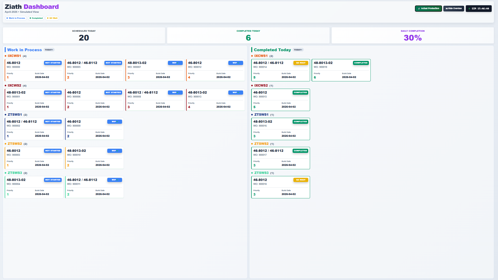

# Production Dashboard

Live production dashboard for the Ziath assembly cell, driven from our Excel build plan and updated in real time via Socket.IO. 

## Screenshot



## Features

- Real-time updates from Excel file changes
- Workstation-based grouping and priority sorting
- Simulation mode for full-view display testing


## Tech Stack

- Node.js + Express
- Socket.IO
- ExcelJS
- Chokidar
- Day.js
- Frontend: vanilla JS + Tailwind CSS

## Prerequisites

- Node.js 18+
- npm
- Access to the configured Excel workbook path in `server.js`

## Setup

```bash
git clone https://github.com/JosephLee43/production-dashboard.git
cd production-dashboard
npm install
```

## Run

```bash
npm start
```

Open:

- `http://localhost:3000`

## Configuration

Main runtime config is in `server.js`:

- `FILE_PATH`: absolute path to the production Excel workbook
- `PORT`: dashboard server port

## Auto-Update Behavior

The server watches the Excel file and emits live updates when changes are detected. It includes:

- queued refresh processing to avoid dropped rapid-save events
- write-stability waiting for OneDrive-style save patterns
- day-rollover refresh 

## Repository

GitHub: `https://github.com/JosephLee43/production-dashboard`

## Changelog

See `CHANGELOG.md` for release notes and recent dashboard updates.
